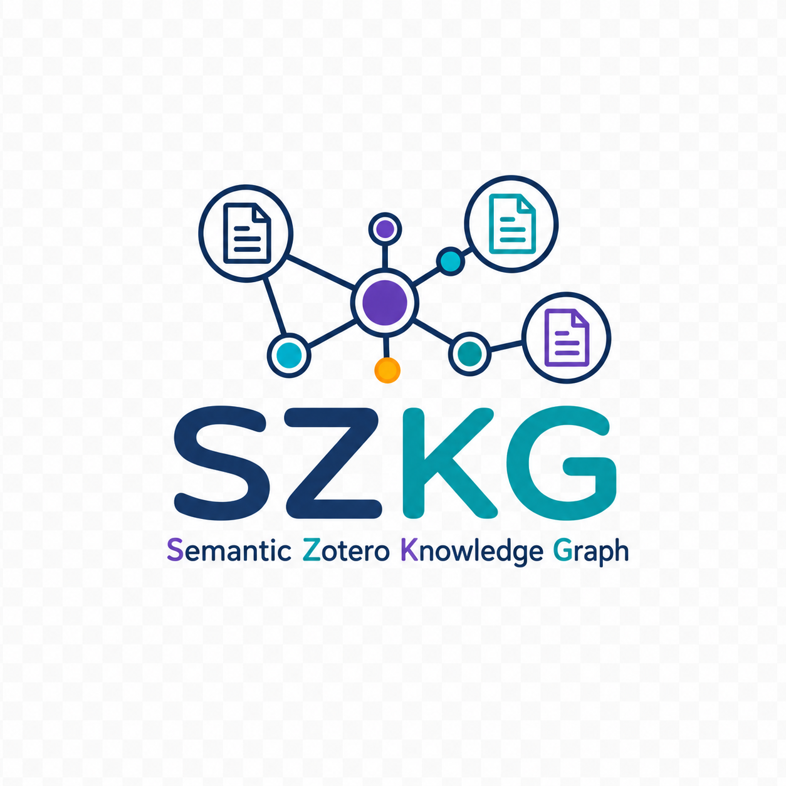

# Semantic Zotero Knowledge Graph

<p align="center">
  
</p>

[](https://github.com/ai-ecoverse/vibe-coded-badge-action)

A local-first application that turns a Zotero research library, or an experimental
Papers by ReadCube collection, into an interactive semantic map.
Papers with similar titles and abstracts appear near
one another, form automatically labeled topics, and are connected by semantic
similarity links.

The data pipeline runs in Python. The map is rendered in the browser with
[Sigma.js](https://www.sigmajs.org/) and WebGL, so thousands of nodes and links
remain responsive on ordinary laptop GPUs. A legacy Cytoscape.js renderer is
kept as a safety fallback.

> The project reads library metadata but never modifies Zotero or Papers.
> Titles and abstracts are sent to the configured embedding API. Vectors,
> topics, graph files, and application state remain in the local `data/`
> directory, which is excluded from Git.

## Latest beta improvements

- **Selectable connectors:** Zotero or Papers, independently paired with OpenAI
  or OpenRouter. The fixed embedding model and scientific pipeline are shared;
  local data is isolated by connector profile.
- **Guided local setup:** configure connections, inspect a read-only preview,
  approve costs and removals, and follow background-job progress in the browser.
  A macOS launcher opens an already-installed environment with a double-click.
- **Safer updates:** single-writer locking, interrupted-run recovery, semantic
  freshness indicators and protection against actions from stale profile tabs.
- **Better exploration:** searchable paper lists, related-paper comparison,
  incomplete-metadata review, keyboard controls and named saved views.
- **Stable visual identity and diagnostics:** conservative topic-color continuity,
  cached topic overlays, map-quality reports and reproducible synthetic tests.

Papers email/password connection and collection discovery have been confirmed
working in a real user session. The connector remains experimental because its
API is unofficial; this is not a guarantee for every account or authentication
method. See [Project status](#project-status) for validation boundaries.

## What users can do

- Build a semantic overview of a personal or group Zotero library.
- Select Papers by ReadCube as an experimental, read-only library connector.
- Choose OpenAI or OpenRouter for the same fixed embedding model.
- Explore automatically discovered topic islands.
- Search paper titles and hide individual topics.
- Distinguish dense topic members from weaker neighbor-based assignments.
- Select a paper to highlight its semantic neighborhood.
- Select a highlighted link to inspect the paper at its other endpoint.
- Open a selected item directly in Zotero.
- Open items correctly from either a personal or group Zotero library.
- Add new papers incrementally without paying to embed cached papers again.
- Re-embed a paper automatically when you edit its title or abstract in the
  selected library, while unchanged papers reuse their profile's cache.
- Remove papers locally when they are trashed, deleted, or become ineligible in
  Zotero, without ever writing back to the Zotero library.
- Reconcile Papers collection membership after a verified complete read.
- Periodically rebuild the complete map for a more globally accurate layout.
- See token usage and estimated embedding cost on every synchronization.
- Configure the local connection and approve sync/rebuild previews in the app.
- Review papers with missing abstracts, filename-like titles or unavailable metadata.
- Save named exploration views locally in your browser.
- Keep topic colors across clear continuations, even when cluster numbers change.

## How it works

The diagram shows the original Zotero/OpenAI path. Papers replaces its source
step with a complete collection read; OpenRouter replaces the API endpoint, not
the embedding model. All downstream analysis and both renderers are shared.

```text
┌──────────────────────────────────────────────┐
│                Zotero Web API                │
│                                              │
│  Incremental retrieval of titles and         │
│  abstracts based on the Zotero library       │
│  version                                     │
└──────────────────────┬───────────────────────┘
                       │
                       ▼
┌──────────────────────────────────────────────┐
│              OpenAI Embeddings               │
│                                              │
│  Generation of one 1,536-dimensional vector  │
│  for each paper not already stored in cache  │
└──────────────────────┬───────────────────────┘
                       │
                       ▼
┌──────────────────────────────────────────────┐
│          LanceDB Local Vector Store          │
│                                              │
│  Persistent embedding cache and cosine       │
│  similarity neighbor search                  │
└───────────────┬──────────────────┬───────────┘
                │                  │
                ▼                  ▼
┌──────────────────────────┐  ┌──────────────────────────────┐
│ k-Nearest-Neighbor Graph │  │ Topic Analysis and Clustering│
│                          │  │                              │
│ Semantic similarity      │  │ PCA                          │
│ relationships between    │  │   ↓                          │
│ papers                   │  │ HDBSCAN                      │
└─────────────┬────────────┘  │   ↓                          │
              │               │ c-TF-IDF                     │
              │               │                              │
              │               │ Produces topic groups and    │
              │               │ descriptive keyword labels   │
              │               └──────────────┬───────────────┘
              │                              │
              └───────────────┬──────────────┘
                              │
                              ▼
┌──────────────────────────────────────────────┐
│           Two-Dimensional Projection         │
│                                              │
│                 PCA → t-SNE                  │
│                                              │
│  Generation of 2D coordinates for graph      │
│  visualization                               │
└──────────────────────┬───────────────────────┘
                       │
                       ▼
┌──────────────────────────────────────────────┐
│                Output Files                  │
│                                              │
│        graph.json and clusters.json          │
└──────────────────────┬───────────────────────┘
                       │
                       ▼
┌──────────────────────────────────────────────┐
│               Visualization                  │
│                                              │
│      Graphology + Sigma.js + WebGL           │
└──────────────────────────────────────────────┘
```

The pipeline deliberately separates responsibilities:

- `zotero_source.py` reads Zotero items behind a replaceable source interface.
- `papers_source.py` authenticates a temporary Papers session, lists collections,
  verifies complete pagination, and normalizes records to the same paper format.
- `profiles.py` selects and isolates library/service combinations without moving
  the existing Zotero/OpenAI data.
- `embeddings.py` defines a provider interface and OpenAI/OpenRouter implementations.
- `store.py` caches paper metadata and vectors in local LanceDB files.
- `graph.py` creates an undirected k-nearest-neighbor similarity graph.
- `clustering.py` discovers topics and derives keyword-based labels.
- `topic_identity.py` tracks conservative topic continuity and persistent colors
  without changing cluster assignments or labels.
- `layout.py` calculates deterministic two-dimensional positions in Python and
  gently tightens dense topic islands while leaving weak members more peripheral.
- `pipeline.py` coordinates full and incremental workflows.
- `data_migration.py` upgrades metadata written by pre-English releases.
- `local_control.py` manages local configuration and one confirmed background job.
- `work_lock.py` prevents supported browser and CLI workflows from writing concurrently.
- `web/library.js` provides the shared setup, preview and job-status controls.
- `web/saved-views.js` stores explicit browser bookmarks for exploration state.
- `web/app-sigma.js` implements the default WebGL map.
- `web/semantic-overlays.js` draws shared soft topic islands and collision-free,
  zoom-aware topic labels above both renderers.
- `web/app-cytoscape.js` preserves the legacy CPU renderer as a fallback.

See [docs/ARCHITECTURE.md](docs/ARCHITECTURE.md) for data contracts and design
details.

## Commands at a glance

Everything runs through `app.py` with one of three verbs:

| Command | When to use it | Network and cost |
| --- | --- | --- |
| `python app.py sync` | Everyday update after adding or editing papers in the selected library. Embeds only new or edited papers and attaches them near their neighbors without moving the existing map. | Reads the selected library; new/edited texts may incur embedding costs. |
| `python app.py refresh` | Occasional full rebuild after substantial changes. Recomputes topics, graph, and layout for the whole library. | Same library/embedding step as `sync`, then a local rebuild that reuses cached vectors. |
| `python app.py serve` | Open the interactive map in your browser. | Local only: no external network and no cost. |

Opening `serve` is offline. Choosing **Preview sync** or **Preview rebuild** in
the browser reads the selected library; choosing **Confirm and apply** may then
send new or edited titles and abstracts to the selected embedding service.
Command-line `sync` and `refresh` retain
their direct execution behavior and do not wait for browser confirmation.

`sync` is fast and stable; `refresh` is slower and reorganizes the topic islands
for a cleaner global picture. Both skip papers whose title and abstract are
unchanged within the same profile. A new profile has a separate cache and may
require a new paid embedding pass.

## Selectable connectors: Papers and OpenRouter

Choose the **Paper library** and **Embedding service** independently under
**Library setup & sync → Connection settings**. Existing settings default to
Zotero + OpenAI; no migration or deletion of the original cache is required.

Both embedding services use **text-embedding-3-small**, explicitly requesting
**1,536 dimensions** and the same `title + "\n\n" + abstract` input. OpenRouter's
model ID is `openai/text-embedding-3-small`; no fallback model is configured.
This keeps the semantic method consistent, but does not guarantee identical
maps: library contents, metadata, provider model revisions and paper ordering
may differ. Cross-library deduplication and vector reuse are not implemented.

### First practical Papers test

1. Start or restart `python app.py serve` to load the current server code.
2. Select **Papers by ReadCube (experimental)**. Enter your Papers email and
   password in the local form, then choose **Connect & list collections**.
3. Select the collection explicitly. Choose **OpenRouter** and enter its API key
   when you are ready to generate embeddings; the read-only preview needs no key.
4. Choose **Save local settings**, then **Preview rebuild**. Check that the
   number of eligible papers agrees with the selected collection. Untitled
   records are skipped; PDFs, annotations and notes are not imported as text.
5. For a connection-only test, choose **Cancel preview**. Choose **Confirm and
   apply** only when you accept sending titles/abstracts and the estimated cost.

The password is used for login and is not written to disk. Session cookies stay
in server memory; closing the tab does not log out, but **Disconnect Papers
session** or restarting the server removes the local session. Reconnect after a
restart or expiry. Email, collection ID and API keys are saved in the local
plaintext `.env`; do not share it. SSO/Google/institutional login and MFA are not
supported by this initial implementation.

The read-only connector is based on the protocol described by the
[ReadCube Papers skill](https://github.com/YusukeKimata-Moo/readcube-papers-skill).
It is **unofficial**, so upstream changes can break it. Unlike Zotero's
version-based updates, every Papers preview reads the complete selected
collection. Missing pages, repeated records, inconsistent counts and API errors
stop the job before local removals or embedding calls. A verified empty
collection still requires confirmation before removing cached records.
Direct links to Papers items are not yet verified and are therefore hidden;
open a record in Papers by searching its title.

### Data isolation and switching back

- Original Zotero + OpenAI data stays in `data/`.
- Other combinations use `data/profiles/<profile-id>/`. The ID includes the
  source, Papers account where applicable, library/collection, embedding service,
  fixed model, dimensions and text-preparation version.
- Maps, vector caches, metadata and saved exploration views are isolated.
  Selecting the original configuration restores its map without copying data.
- The original Zotero/OpenAI profile still refuses to replace a different
  Zotero library in its existing data folder. This is not a general-purpose
  multiple-account profile manager yet.

The integration has automated and browser tests with synthetic data; a real user
has also confirmed Papers connection and collection discovery after the API
compatibility fixes. No separate authenticated end-to-end OpenRouter billing
test is recorded in the release checks. Simulated tests verify the selected
model, dimensions, request construction and cache behavior, not live service
availability or billing.

OpenRouter uses its [embedding endpoint](https://openrouter.ai/docs/api/api-reference/embeddings/submit-an-embedding-request).
Approved texts pass through OpenRouter to the model provider; review
[OpenRouter's privacy policy](https://openrouter.ai/privacy) before submitting
private material. The model is deliberately fixed in this first release.

### Papers connection compatibility and troubleshooting

The current connector lists collections from `services.readcube.com/collections`;
the older `sync.readcube.com/collections/` address redirects there. Item reads
still use the sync API. The parser accepts the current response format without
requiring the legacy `status: "ok"` field, and supports both `id` and
`collection_id` for collection identities. Explicit errors and malformed data
remain blocked.

ReadCube may return its login cookie on a redirect response. SZKG does not follow
that redirect or resend credentials to its destination: it verifies the received
session by reading collections from the fixed ReadCube endpoint.

Connection progress, success and failures appear immediately below **Connect &
list collections**. Errors identify the stage (`PAPERS_LOGIN`, `PAPERS_SESSION`
or `PAPERS_COLLECTIONS`); unexpected JSON can include a safe field-type summary,
never raw private values. Share that message when reporting a problem, not your
password, cookie, API key, `.env`, or generated library files. After an update to
Python code, stop and restart the server; refreshing the browser alone cannot
load new server code.

## Results depend on metadata quality

The map is built only from each paper's **title and abstract** — not the PDF full
text, authors, tags, or notes. A paper is therefore placed only as well as its
metadata describes it, and the **abstract matters most**:

- A missing or very short abstract leaves the model little to work with, so the
  paper gets a weak position and often lands in a loose or `unclassified` area.
- A title that is actually a filename (for example `Larson2019.pdf`) carries no
  meaning and causes the same problem.

For the best map, keep titles and abstracts complete in your reference manager. Run
`python data_quality.py` to list papers with missing abstracts or filename-like
titles; after you fix them at the source, `python app.py sync` re-embeds those papers
and `python app.py refresh` repositions them.

## Requirements

### Required for normal use

- Python 3.12 or newer. Development is currently tested with Python 3.14.
- A synchronized Zotero account and dedicated read-only API key, or a Papers
  account with email/password login and a collection to test.
- An OpenAI or OpenRouter API key with billing or credits enabled for new embeddings.
- Internet access while reading the library and generating new embeddings.
- A browser with WebGL support.

Python dependencies are listed in `requirements.txt`:

| Dependency | Purpose |
| --- | --- |
| `pyzotero` | Zotero Web API access and pagination |
| `openai` | embedding requests |
| `tiktoken` | pre-request token and cost estimation |
| `lancedb` + `pyarrow` | local vector storage |
| `numpy` + `scikit-learn` | graph preparation, PCA, HDBSCAN, and t-SNE |
| `python-dotenv` | local `.env` configuration |

### Required only for frontend development

- Node.js 20 or newer
- npm

The compiled WebGL bundle is committed under `web/dist/`, so end users do not
need Node.js or npm.

## Installation

Clone the repository and enter it:

```bash
git clone https://github.com/internalempire/szkg.git
cd szkg
```

Create an isolated Python environment:

```bash
python3 -m venv .venv
source .venv/bin/activate
python -m pip install --upgrade pip
pip install -r requirements.txt
```

On Windows PowerShell, activate it with:

```powershell
.venv\Scripts\Activate.ps1
```

You can now run `python app.py serve` and configure the connection in
**Library setup & sync → Connection settings**, without editing a file.
On macOS, after this one-time Python installation, double-click
**Launch SZKG.command** to open the app. Keep its Terminal window open while
using SZKG. The launcher does not install Python or dependencies automatically;
it is not a packaged desktop installer.

Alternatively, create the local configuration file manually:

```bash
cp .env.example .env
```

Then fill in:

```dotenv
ZOTERO_LIBRARY_ID=1234567
ZOTERO_LIBRARY_TYPE=user
ZOTERO_API_KEY=your_read_only_zotero_key
OPENAI_API_KEY=your_openai_key
```

`ZOTERO_LIBRARY_TYPE` can be `user` for a personal library or `group` for a
shared group library. Zotero documents API authentication and version-based
incremental reads in its
[Web API documentation](https://www.zotero.org/support/dev/web_api/v3/basics).

## First run

### Guided browser workflow

1. Open `python app.py serve` (or the macOS launcher).
2. Select your connectors. For Zotero, enter the numeric library ID,
   personal/group type and read-only key. For Papers, follow the session login
   steps above. Add the selected embedding service's key when ready.
3. Choose **Save local settings**. Secrets are stored in the Git-ignored `.env`
   file, with owner-only file permissions on macOS/Linux, not encrypted. The
   browser receives only whether a key is saved; blank key fields preserve it.
4. Choose **Preview rebuild** for a first map, or **Preview sync** for everyday
   updates. This verifies library access and reads metadata, without sending text
   to an embedding service. The preview shows paper counts, removals, tokens,
   model and a cost estimate. You may inspect it without an embedding API key.
5. Review the privacy/cost and layout warnings, then **Confirm and apply**, or
   **Cancel preview**. Confirmation is required even for zero-cost updates.
6. Follow the stage messages, then choose **Open updated map**. An existing map
   reloads its local data; the first map opens with a page reload.

Previews expire after 30 minutes. Cancellation is available before confirmation;
confirmed jobs finish in the background, even if you close the browser tab.
There is no force-cancel button during writes. Keep the launcher running; a
normal server shutdown waits for a confirmed job to finish. After a crash or
restart, prepare a fresh preview; completed embedding batches remain cached.

Only one supported writer can run at a time, including CLI updates. Configuration
changes are blocked during a job. The legacy Zotero/OpenAI profile refuses a
different Zotero library; other combinations use the isolated profiles described
above. Environment variables override `.env`; the setup
form reports such conflicts instead of pretending to change the effective value.

The **Local library health** summary reports mapped papers and missing abstracts
among saved metadata records. It is not a replacement for the detailed diagnostic
scripts below. Existing maps remain available offline without valid API keys.

### Optional command-line workflow

Build the complete map:

```bash
python app.py refresh
```

This command:

1. downloads eligible records from the selected source;
2. embeds only papers that are not already cached;
3. stores vectors locally;
4. rebuilds the similarity graph and topics;
5. recalculates the complete two-dimensional layout;
6. writes browser-ready JSON files under the selected profile's data directory.

For Papers, command-line sync/refresh prompts for its password without echoing
or saving it. Each invocation starts a separate temporary login session.

Open the viewer:

```bash
python app.py serve
```

The server listens only on `127.0.0.1`, chooses a free port between 8000 and
8019, and opens the browser automatically. It serves allowlisted viewer assets,
generated JSON and a same-origin local control API. Credentials are never served
back to clients; Git metadata and the vector database are not HTTP resources.
Stop it with `Ctrl+C` when no job is running.

## Everyday workflow

### Updating from the browser

After adding a paper in Zotero or Papers, let that application finish its cloud
synchronization. In SZKG, keep the same library/collection and embedding service,
then choose **Preview sync → Confirm and apply → Open updated map**. Reconnect
Papers first if the local server has restarted or the session has expired.

The completed map, metadata and embedding vectors remain on your computer after
you close SZKG. Reopening the app reads the saved map without rebuilding it or
contacting an embedding service. A preview alone does not publish a new map.

| Change in the selected source | Result after confirming sync |
| --- | --- |
| New paper | Generate its embedding and place it near existing semantic neighbors. |
| Edited title or abstract | Update its embedding and displayed metadata; a full rebuild updates its semantic links, topic and position. |
| Unchanged paper | Reuse its cached embedding; no new embedding request. |
| Removed or ineligible paper | Remove it from this profile's local cache and map; never edit the source library. |

Choose **Preview rebuild** occasionally after substantial additions or text
corrections. It reuses unchanged cached vectors but recalculates the global map,
so existing papers and topic islands may move. Switching connector profiles does
not share their caches and can require a new paid embedding pass.

### Command-line updates and recovery

With the configured profile selected, run:

```bash
python app.py sync
```

With Zotero, `sync` asks only for items modified after the stored library version.
With Papers, it verifies the complete collection and compares its text with the
selected local cache, so unchanged records are still not re-embedded.
It embeds papers that are new or whose title or abstract you edited, then places
each new paper near its existing semantic neighbors. It also removes locally
cached papers reported as trashed or deleted by Zotero, or absent from a verified
complete Papers collection snapshot. Existing topic assignments
and positions remain stable; an edited paper keeps its place until the next
`refresh` moves it to match its new text.

Synchronization is resumable. The saved Zotero version advances only after the
map update succeeds, and a later `sync` reconciles any cached paper missing from
the browser map after an interrupted run. It also compares content fingerprints
to recover edited titles or abstracts saved in the cache before an interruption,
without requesting those saved embeddings again.

Both renderers show the last completed library sync, the last full map rebuild,
and how many added or edited papers still need full reorganization. An edited
paper keeps its existing links, topic, and coordinates during `sync`; the pending
status is cleared only after a successful full rebuild. Removing a pending paper
also removes it from the count. Metadata-only changes do not add to this count.

Older maps remain usable and display **Rebuild status unknown** until their first
full rebuild with this version. A normal sync establishes fingerprints for future
recovery, but cannot retrospectively verify abstract edits from before those
fingerprints existed. No data deletion or embedding-cache migration is needed.

Occasionally run:

```bash
python app.py refresh
```

`refresh` reuses cached embeddings, but recomputes the graph, topics, labels,
and layout for the complete collection. It is slower and moves topic islands,
but provides a cleaner global organization after substantial library growth.

For a full rebuild that also prints a textual report of the discovered topics and
graph shape, the legacy `python build_map.py` entry point remains available. New
users should prefer `python app.py refresh`.

## Viewer controls

- Hover over a node to see its title.
- Click a node to show its metadata and semantic neighborhood.
- Click an amber link to inspect the connected paper in a second panel.
- Use the topic legend to preview, lock, show, or hide topic islands.
- Filter the topic legend by keyword and use the map key to distinguish core
  papers, weak assignments, and semantic links.
- Move the pointer near a topic label to fade it and reveal clickable papers
  underneath without moving the label's semantic anchor.
- Search titles to highlight matches and browse a selectable list (20 papers per
  page). Search words can appear in any order. Choose a result to open its
  details and center it on the map; use **Browse all papers** without a query.
- Choose **Review incomplete papers** to list mapped papers with empty abstracts,
  filename-like titles, or unavailable local abstract metadata. Each row explains
  its flags and offers **Open on map**, plus **Open in Zotero** for Zotero profiles. Title search and
  pagination also work within this list; a paper can have more than one flag.
  This is a local, read-only check of the loaded map, not a live library scan.
  Unavailable metadata is not treated as a confirmed missing abstract; filename
  detection is a review suggestion. The CLI `data_quality.py` checks the vector
  cache instead, which may include papers not yet published on the map.
  After correcting metadata in your reference manager, let it sync, run **Preview sync** and
  confirm the update, then **Reload local map**. Changed text may require paid
  embeddings after confirmation; opening this review list never does.
- Results hidden by topic or weak-assignment filters are explicitly marked.
  **Show & open** restores that topic and, when necessary, weak assignments.
- In a paper's details, choose a **Related paper** to compare it in the second
  panel. Links are sorted by cosine similarity, not citation count or probability.
- Use Tab for controls, Down from the search box to reach results, arrow keys
  within the result list, Enter to open, and Escape to close a detail panel.
  Topic highlighting and visibility are also keyboard-operable.
- Toggle weak assignments on or off.
- Use the wheel, double-click, or `+` / `-` controls to zoom.
- **Fit map** changes only the camera. **Clear filters** clears searches,
  selections and visibility filters without moving the camera.
- Use **Reload local map** after a background `sync` or `refresh` to reconcile
  nodes, links, topics, and coordinates without reloading the whole page. This
  button only reads local files: it does not contact a library or embedding API.
  Progress and errors appear inline; repeat clicks are blocked while loading.
- Hide or show the search sidebar to give the map more room. On narrow windows
  it starts collapsed and closes when opening a search result.

### Saved views and stable topic colors

Open **Saved views**, enter a name, and choose **Save current view**. A view stores
the title search, incomplete-paper review mode, topic-list search, visibility filters, highlighted topic,
selected paper and camera. Choose its name and **Open view** to return to it.
Up to 20 views per library are supported; deletion has an **Undo deletion** action.
The second comparison panel is not saved. Nothing resumes automatically on startup.

Views live in browser storage, separated by connector profile; the original
Zotero/OpenAI profile preserves its previous library-based bookmark identity. They contain
names, search text and paper IDs, but no API keys, abstracts or embedding vectors.
They stay in that browser profile and local address (including the port): opening
a different port/browser or clearing browser data will not carry them over.
They are bookmarks, not a library backup. Storage errors are reported inline.

After a full rebuild, numeric cluster IDs may change. Topic continuity instead
uses shared **core papers**: clear one-to-one matches retain a persistent identity
and color. Splits, merges and ambiguous changes get fresh identities. This is a
conservative display heuristic, not proof that a scientific topic is unchanged.
Open **Topic continuity** in the legend for the last rebuild's summary.

The next successful sync or rebuild adds these fields automatically; existing
maps remain readable and need no vector-cache migration. Legacy colors are kept
when first recording their identities. Views saved before that first publication
cannot carry legacy topic filters across changed revisions. Missing or changed
topic filters are skipped with an explanation rather than applied to an unrelated
topic. If positions changed or you switch renderer, the camera centers the saved
paper (when visible), or fits the map; old camera coordinates are not reused.

### Renderer diagnostics

Sigma.js/WebGL is the default. To load the legacy Cytoscape renderer:

```text
http://127.0.0.1:8000/web/index.html?renderer=cytoscape
```

To compare Sigma curved edges with straight edges:

```text
http://127.0.0.1:8000/web/index.html?edges=straight
```

## Cost behavior

Only new or edited papers within the selected profile incur an embedding API
cost. Before sending text, the app
estimates tokens and price; after the request it records the API-reported token
usage. Cached papers whose title and abstract are unchanged are skipped through
the LanceDB cache, so an unrelated change such as a tag never costs anything.

Prices can change. The local pricing table used for estimates is intentionally
centralized in `costs.py`; verify it against current provider pricing when exact
cost forecasting matters.
An unknown model price is shown as unavailable, never as zero. Estimates are
not a billing guarantee and do not include possible account fees or retries.

## Privacy and repository safety

The public repository intentionally excludes:

- `.env` and all real API keys;
- `data/lancedb/` embedding vectors;
- `graph.json`, `clusters.json`, and `state.json`;
- `metadata.json` and the non-secret local viewer configuration;
- Zotero/Papers titles and abstracts, including all profile subdirectories;
- local Python and Node dependency folders.

Do not remove these entries from `.gitignore`. Use a Zotero API key with library
read access only. The application does not contain Zotero or Papers write operations.
Papers authentication, collection reads and embedding calls are the new outbound operations;
opening an existing map remains offline.

## Diagnostics

These optional scripts help isolate problems without rebuilding the complete
map:

`data_quality.py`, `map_quality.py` and `neighbors.py` inspect the **currently
selected profile**. `diagnose_zotero.py` and `test_zotero.py` remain explicitly
Zotero-only. The legacy `test_embedding.py` and `build_map.py` reject other
connector combinations; use the guided Papers preview and `app.py` instead.

| Script | What it checks | Network and data effects |
| --- | --- | --- |
| `python diagnose_zotero.py` | Counts everything visible to the configured Zotero key, lists up to 20 collections, and shows five raw items including attachments. Use it when the normal importer reports an empty library or when you suspect the wrong library ID, type, synchronization state, or key permissions. | Reads the Zotero Web API. It never modifies the library and makes no OpenAI request. |
| `python data_quality.py` | Inspects the local LanceDB cache for titles that look like filenames and papers without abstracts. These records can produce weak semantic positions because the embedding has little useful text. | Local and read-only; no network or API cost. |
| `python map_quality.py` | Reports metadata coverage, pending changes and preservation of vector neighborhoods in the 2D map, within a bounded sample. Optional `--compare-compaction` recomputes a layout in memory to compare before/after island compaction. | No network, embeddings or map/cache writes. Uses the local writer lock while reading; the optional comparison can take minutes. Scores do not measure scientific validity. |
| `python neighbors.py "part of a paper title"` | Finds matching cached papers and explains each paper's topic, weak-assignment status, graph-link count, and eight closest semantic neighbors with similarity percentages. A `+` marks neighbors above the graph threshold. Use it to understand why a paper appears in a particular area or topic. | Local and read-only; no network or API cost. |
| `python test_zotero.py` | Downloads a sample of eight eligible papers and prints their type, key, version, title, and a shortened abstract. Use it to verify that credentials work and that the normal importer receives useful metadata. | Reads the Zotero Web API. It does not write to Zotero, call OpenAI, or alter the local map. |
| `python test_embedding.py` | Exercises the complete small-sample path: fetches five Zotero papers, skips cached keys, estimates token cost, embeds only uncached samples, verifies vector dimensions, and stores the new vectors in LanceDB. | Reads Zotero and can make a paid OpenAI request. It adds uncached sample papers to the local embedding cache, but does not rebuild the map or modify Zotero. |

Run them from the project directory with the Python environment active:

```bash
python diagnose_zotero.py
python data_quality.py
python map_quality.py
python neighbors.py "part of a paper title"
python test_zotero.py
python test_embedding.py
```

Start with `diagnose_zotero.py` or `test_zotero.py` for connection problems,
`data_quality.py` for suspicious map content, and `neighbors.py` for a single
paper that appears misplaced. Run `test_embedding.py` only when you explicitly
want to test the paid embedding path.

See [docs/QUALITY.md](docs/QUALITY.md) for score interpretation, reproducible
comparisons and a human-reviewed evaluation protocol. Do not change clustering
or projection algorithms on the strength of a single score.

## Frontend development

Install pinned JavaScript dependencies and rebuild the offline bundle:

```bash
npm install
npm run build:web
```

Run static frontend checks:

```bash
npm test
```

This also runs network-free tests for the shared map-status and discovery logic.

For the isolated topic-overlay CPU benchmark:

```bash
npm run benchmark:overlays
```

It compares rebuilding island geometry with reusing it on 2,500 synthetic nodes.
Canvas and DOM are mocked: the result is **not** a browser FPS or GPU benchmark.
Both renderers cache island outlines and anchors until data, visibility, node
positions or camera orientation change. Pan and zoom then project only those
cached points. Sigma still draws edges during movement and retains edge picking.

## Tests

With the Python environment active:

```bash
python -m unittest discover -s tests -v
```

The automated suite is network-free and never reads `.env` or personal `data/`.
Manual API smoke tests remain separate so CI cannot spend money or access a
private Zotero or Papers library.

For a disposable, fully simulated browser test of setup and job confirmation:

```bash
PYTHONPATH=. python tests/preview_control.py
```

Open the printed loopback address and enter dummy keys only. This fixture uses
a temporary data folder, does not expose the real library, and never calls Zotero
or OpenAI. Stop it with Ctrl+C to discard its settings and synthetic map.

For a prepopulated synthetic map with saved-view and topic-change scenarios:

```bash
PYTHONPATH=. python tests/preview_refinement.py
```

This uses a separate loopback port and fake library identity. Its simulated
rebuild renumbers one continuing topic, splits another, and moves coordinates.
It never serves personal data or calls external services. Browser bookmarks made
in this fixture can be deleted using its Saved views controls.

For the selectable-connector setup and Papers login error/success flow:

```bash
PYTHONPATH=. python tests/preview_connectors.py
```

Use a fictional email and dummy password only. The password `fail` simulates a
login error; another nonempty dummy password returns synthetic collections.
Selecting **Synthetic incomplete read** demonstrates a blocked preview. No
real authentication, library access or paid embedding occurs; all settings and
map files belong to a disposable temporary directory.

## Project status

The alpha phase is complete; the project is in local beta development. The
shared Python pipeline, selectable library/embedding connectors, persistent
profile caches, guided local workflow, WebGL viewer and legacy renderer are
implemented. Existing English-schema and bookmark migrations remain automatic.

Validation for this update: **111 Python tests and 26 JavaScript tests**, plus
manual browser checks with synthetic data on Sigma and Cytoscape, including a
390-pixel-wide viewport. Python tests include a real temporary LanceDB cache and
loopback HTTP tests; no test contacts a paid service. GitHub Actions also checks
that the committed WebGL bundle matches its sources.

Known boundaries:

- Papers is unofficial and currently supports email/password login only, not
  SSO/MFA; direct links to its individual records are not verified.
- The model remains fixed; arbitrary model selection and cross-profile vector
  reuse are not implemented.
- Papers rereads complete collections. Strict pagination detects common partial
  reads but cannot prove an atomic remote snapshot during concurrent edits.
- API keys are stored locally in plaintext, not an OS keychain. The HTTP server
  is loopback-only and is not designed for public hosting or multi-user access.
- Saved views are browser-local bookmarks, not backups; cost estimates are not
  quotes or spending caps; semantic similarity is not scientific validation.

See [Architecture](docs/ARCHITECTURE.md) and
[Quality and evaluation](docs/QUALITY.md). Contributions and issue reports are welcome.

## License

Distributed under the [MIT License](LICENSE).
